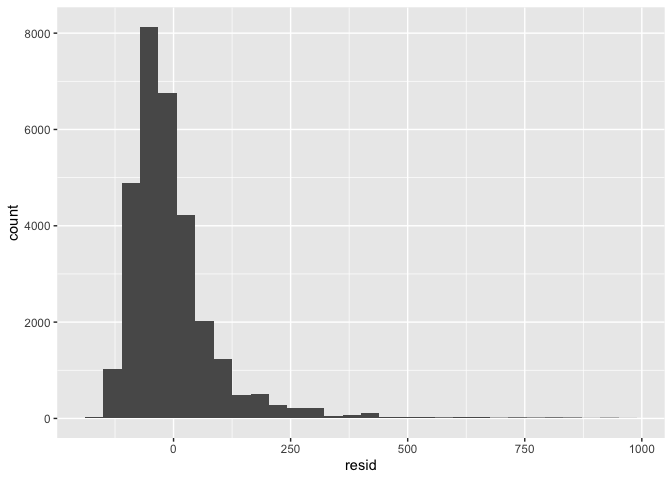
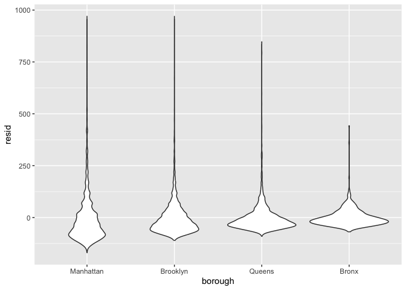

Linear Models
================
Mukta Patwari
2025-11-06

Load necessary packages

``` r
library(tidyverse)
```

    ## ── Attaching core tidyverse packages ──────────────────────── tidyverse 2.0.0 ──
    ## ✔ dplyr     1.1.4     ✔ readr     2.1.5
    ## ✔ forcats   1.0.0     ✔ stringr   1.5.2
    ## ✔ ggplot2   4.0.0     ✔ tibble    3.3.0
    ## ✔ lubridate 1.9.4     ✔ tidyr     1.3.1
    ## ✔ purrr     1.1.0     
    ## ── Conflicts ────────────────────────────────────────── tidyverse_conflicts() ──
    ## ✖ dplyr::filter() masks stats::filter()
    ## ✖ dplyr::lag()    masks stats::lag()
    ## ℹ Use the conflicted package (<http://conflicted.r-lib.org/>) to force all conflicts to become errors

``` r
library(p8105.datasets)

set.seed(1)
```

Load dataset, do some cleaning

``` r
data(nyc_airbnb)

nyc_airbnb =
  nyc_airbnb %>% 
  mutate(
    stars = review_scores_location / 2
  ) %>% 
  rename(
    borough = neighbourhood_group
  ) %>% 
  filter(borough != "Staten Island") %>% 
  select(price, stars, borough, room_type, neighbourhood)
```

Regression

``` r
fit = lm(price ~ stars + borough, data = nyc_airbnb)
```

Do some additional cleaning, then refit

``` r
nyc_airbnb =
  nyc_airbnb %>% 
  mutate(
    borough = fct_infreq(borough), # putting categories in order of how frequently they appear in the dataset
    room_type = fct_infreq(room_type)
  )

fit = lm(price ~ stars + borough, data = nyc_airbnb)
```

Look at `lm` stuff

``` r
summary(fit)
names(summary(fit))
summary(fit)[["coefficients"]]
summary(fit)[["df"]]

fitted.values(fit)
```

Look at cleaner `lm` stuff

``` r
fit %>% 
  broom::tidy() %>% 
  mutate(
    term = str_replace(term, "borough", "Borough: ")
  ) %>% 
  select(term, estimate, p.value) %>% 
  knitr::kable(digits = 3)
```

| term              | estimate | p.value |
|:------------------|---------:|--------:|
| (Intercept)       |   19.839 |   0.104 |
| stars             |   31.990 |   0.000 |
| Borough: Brooklyn |  -49.754 |   0.000 |
| Borough: Queens   |  -77.048 |   0.000 |
| Borough: Bronx    |  -90.254 |   0.000 |

``` r
fit %>% 
  broom::glance()
```

    ## # A tibble: 1 × 12
    ##   r.squared adj.r.squared sigma statistic   p.value    df   logLik    AIC    BIC
    ##       <dbl>         <dbl> <dbl>     <dbl>     <dbl> <dbl>    <dbl>  <dbl>  <dbl>
    ## 1    0.0342        0.0341  182.      271. 6.73e-229     4 -202113. 4.04e5 4.04e5
    ## # ℹ 3 more variables: deviance <dbl>, df.residual <int>, nobs <int>

## Diagnostics

Look at residuals.

``` r
nyc_airbnb %>% 
  modelr::add_residuals(fit) %>% 
  modelr::add_predictions(fit) %>% 
  filter(resid < 1000) %>% 
  ggplot(aes(x = resid)) +
  geom_histogram()
```

    ## `stat_bin()` using `bins = 30`. Pick better value `binwidth`.

<!-- -->

``` r
nyc_airbnb %>% 
  modelr::add_residuals(fit) %>% 
  modelr::add_predictions(fit) %>% 
  filter(resid < 1000) %>% 
  ggplot(aes(x = borough, y = resid)) +
  geom_violin()
```

<!-- -->

``` r
nyc_airbnb %>% 
  modelr::add_residuals(fit) %>% 
  modelr::add_predictions(fit) %>% 
  filter(resid < 1000) %>% 
  ggplot(aes(x = stars, y = resid)) +
  geom_point()
```

<!-- -->

What about a categorical variable?

``` r
fit_alt = lm(price ~ stars + borough + room_type, data = nyc_airbnb)
fit_null = lm(price ~ stars + borough, data = nyc_airbnb)

anova(fit_null, fit_alt)
```

    ## Analysis of Variance Table
    ## 
    ## Model 1: price ~ stars + borough
    ## Model 2: price ~ stars + borough + room_type
    ##   Res.Df        RSS Df Sum of Sq      F    Pr(>F)    
    ## 1  30525 1005601724                                  
    ## 2  30523  921447496  2  84154228 1393.8 < 2.2e-16 ***
    ## ---
    ## Signif. codes:  0 '***' 0.001 '**' 0.01 '*' 0.05 '.' 0.1 ' ' 1

## Interactions vs nested data

``` r
fit_interactions =
  lm(price ~ stars * borough + room_type * borough, data = nyc_airbnb) %>% 
  broom::tidy() 
```

Let’s just look at Brooklyn first.

``` r
nyc_airbnb %>% 
  filter(borough == "Brooklyn") %>% 
  lm(price ~ stars + room_type, data = .) %>% 
  broom::tidy()
```

    ## # A tibble: 4 × 5
    ##   term                  estimate std.error statistic   p.value
    ##   <chr>                    <dbl>     <dbl>     <dbl>     <dbl>
    ## 1 (Intercept)               69.6     14.0       4.96 7.27e-  7
    ## 2 stars                     21.0      2.98      7.05 1.90e- 12
    ## 3 room_typePrivate room    -92.2      2.72    -34.0  6.40e-242
    ## 4 room_typeShared room    -106.       9.43    -11.2  4.15e- 29

``` r
nyc_airbnb %>% 
  filter(borough == "Manhattan") %>% 
  lm(price ~ stars + room_type, data = .) %>% 
  broom::tidy()
```

    ## # A tibble: 4 × 5
    ##   term                  estimate std.error statistic   p.value
    ##   <chr>                    <dbl>     <dbl>     <dbl>     <dbl>
    ## 1 (Intercept)               95.7     22.2       4.31 1.62e-  5
    ## 2 stars                     27.1      4.59      5.91 3.45e-  9
    ## 3 room_typePrivate room   -124.       3.46    -35.8  9.40e-270
    ## 4 room_typeShared room    -154.      10.1     -15.3  2.47e- 52

``` r
nyc_airbnb %>% 
  filter(borough == "Queens") %>% 
  lm(price ~ stars + room_type, data = .) %>% 
  broom::tidy()
```

    ## # A tibble: 4 × 5
    ##   term                  estimate std.error statistic  p.value
    ##   <chr>                    <dbl>     <dbl>     <dbl>    <dbl>
    ## 1 (Intercept)              91.6      25.8       3.54 4.00e- 4
    ## 2 stars                     9.65      5.45      1.77 7.65e- 2
    ## 3 room_typePrivate room   -69.3       4.92    -14.1  1.48e-43
    ## 4 room_typeShared room    -95.0      11.3      -8.43 5.52e-17

``` r
nyc_airbnb %>% 
  filter(borough == "Bronx") %>% 
  lm(price ~ stars + room_type, data = .) %>% 
  broom::tidy()
```

    ## # A tibble: 4 × 5
    ##   term                  estimate std.error statistic  p.value
    ##   <chr>                    <dbl>     <dbl>     <dbl>    <dbl>
    ## 1 (Intercept)              90.1      15.2       5.94 5.73e- 9
    ## 2 stars                     4.45      3.35      1.33 1.85e- 1
    ## 3 room_typePrivate room   -52.9       3.57    -14.8  6.21e-41
    ## 4 room_typeShared room    -70.5       8.36     -8.44 4.16e-16

Write a short function

``` r
lm_airbnb = function(df){
  lm(price ~ stars + room_type, data = df)
}

nyc_airbnb %>% 
  filter(borough == "Bronx") %>% 
  lm_airbnb %>% 
  broom::tidy()
```

    ## # A tibble: 4 × 5
    ##   term                  estimate std.error statistic  p.value
    ##   <chr>                    <dbl>     <dbl>     <dbl>    <dbl>
    ## 1 (Intercept)              90.1      15.2       5.94 5.73e- 9
    ## 2 stars                     4.45      3.35      1.33 1.85e- 1
    ## 3 room_typePrivate room   -52.9       3.57    -14.8  6.21e-41
    ## 4 room_typeShared room    -70.5       8.36     -8.44 4.16e-16

Create a list of dataframes, iterate to fit the model each time

``` r
nested_lm_results =
  nyc_airbnb %>% 
  nest(data = -borough) %>% 
  mutate(
    fits = map(data, lm_airbnb),
    results = map(fits, broom::tidy)
  ) %>% 
  select(borough, results) %>% 
  unnest(results)
```

Do some un-tidying

``` r
nested_lm_results %>% 
  select(borough, term, estimate) %>% 
  pivot_wider(
    names_from = term,
    values_from = estimate
  )
```

    ## # A tibble: 4 × 5
    ##   borough   `(Intercept)` stars `room_typePrivate room` `room_typeShared room`
    ##   <fct>             <dbl> <dbl>                   <dbl>                  <dbl>
    ## 1 Bronx              90.1  4.45                   -52.9                  -70.5
    ## 2 Queens             91.6  9.65                   -69.3                  -95.0
    ## 3 Brooklyn           69.6 21.0                    -92.2                 -106. 
    ## 4 Manhattan          95.7 27.1                   -124.                  -154.

Use an *anonymous* function instead of `lm_airbnb`

``` r
nested_lm_results =
  nyc_airbnb %>% 
  nest(data = -borough) %>% 
  mutate(
    fits = map(data, \(df) lm(price ~ stars + room_type, data = df)), # imagine you never wrote lm_airbnb function
    results = map(fits, broom::tidy)
  ) %>% 
  select(borough, results) %>% 
  unnest(results)
```

More extreme example

``` r
manhattan_analysis =
  nyc_airbnb %>% 
  filter(borough == "Manhattan") %>% 
  nest(data = -neighbourhood) %>% 
  mutate(
    fits = map(data, \(df) lm(price ~ stars + room_type, data = df)),
    results = map(fits, broom::tidy)
  ) %>% 
  select(neighbourhood, results) %>% 
  unnest(results)
```

Make a plot

``` r
manhattan_analysis %>% 
  filter(term == "stars") %>% 
  mutate(
    neighbourhood = fct_reorder(neighbourhood, estimate)
  ) %>% 
  ggplot(aes(x = neighbourhood, y = estimate)) +
  geom_point() +
  theme(axis.text.x = element_text(angle = 45, hjust = 1))
```

<!-- -->
